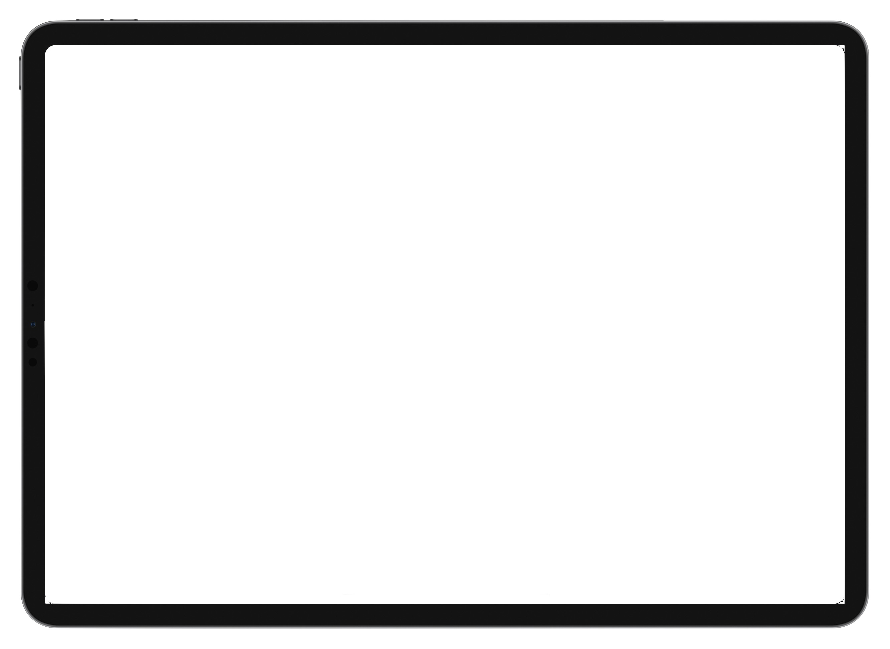

:::tip
使用 [Scriptable](https://scriptable.app/) DIY 好玩的 iOS 组件
:::

### 1. iOS 提醒事项同步到日历

**参考下面视频 [ :link: 终极解决方案！一键同步 ios【提醒事项】到【日历】 ](https://www.bilibili.com/video/BV1pK4y1Y7DX?share_source=copy_web) up 主的脚本修改**  
**up 主 repo 地址：[ :link: zackertypical / ios_script](https://github.com/zackertypical/ios_script)**

<div style="position: relative; padding: 30% 45%;">
	<iframe 
		style="position: absolute; width: 100%; height: 100%; left: 0; top: 0;"
		src="//player.bilibili.com/player.html?aid=884223998&bvid=BV1pK4y1Y7DX&cid=221125239&page=1&high_quality=1&danmaku=0" 
		scrolling="no" 
		border="0" 
		frameborder="no" 
		framespacing="0" 
		allowfullscreen="true" 
		loading="lazy"
	>
	</iframe>
</div>

👇 修改说明：[ :link: iOS【提醒事项】同步到【日历】—— Scriptable 的灵活 DIY ](https://www.bilibili.com/video/BV1dK4y1d7xT?share_source=copy_web)

<div style="position: relative; padding: 30% 45%;">
	<iframe 
		style="position: absolute; width: 100%; height: 100%; left: 0; top: 0;"
		src="//player.bilibili.com/player.html?aid=930598306&bvid=BV1dK4y1d7xT&cid=338475224&page=1&high_quality=1&danmaku=0" 
		scrolling="no" 
		border="0" 
		frameborder="no" 
		framespacing="0" 
		allowfullscreen="true" 
		loading="lazy"
	>
	</iframe>
</div>

- **脚本一：**
  > 1. 修改了时间最小单位（当天精确到分钟，隔天精确到小时）
  > 2. 完成信息挪到了标题中，顺带去掉了底部的地图定位
  > 3. 尝试了几种替换掉 identifier 的方案，多多少少都会引入功能性的 bug，只好牺牲美观性，在备注里保留 identifier（更新的时候要用来校验过滤）了
  > 4. 其他细节更改见如下示例图

:::details 点击查看脚本

```js
//要同步的时间段，当前时间前后n个月，例如，当前为5月，设置为2时，同步时间段为3～7月
var dur_month = 2;

const startDate = new Date();
startDate.setMonth(startDate.getMonth() - dur_month);
console.log(`日历的开始时间 ${startDate.toLocaleDateString()}`);

const endDate = new Date();
endDate.setMonth(endDate.getMonth() + dur_month);
console.log(`日历的结束时间 ${endDate.toLocaleDateString()}`);

const reminders = await Reminder.allDueBetween(startDate, endDate);
console.log(`获取 ${reminders.length} 条提醒事项`);

var calendar = await Calendar.forEvents();

//获取日历名和对应的日历
var m_dict = {};
for (cal of calendar) {
  m_dict[cal.title] = cal;
  //console.log(`日历:${cal.title}`)
}

const events = await CalendarEvent.between(startDate, endDate, calendar);
console.log(`获取 ${events.length} 条日历`);
console.log(events);

for (const reminder of reminders) {
  reminder.notes =
    !reminder.notes || reminder.notes == null || reminder.notes == 'undefined'
      ? '无'
      : reminder.notes;
  //reminder的标识符
  const targetNote = `[Reminder ID] ${reminder.identifier}`;
  const [targetEvent] = events.filter(
    (e) => e.notes != null && e.notes.indexOf(targetNote) != -1
  ); //过滤重复的reminder
  if (!m_dict[reminder.calendar.title]) {
    console.warn('找不到日历' + reminder.calendar.title);
    continue;
  }
  if (targetEvent) {
    //console.log(`找到已经创建的事项 ${reminder.title}`)
    updateEvent(targetEvent, reminder);
  } else {
    console.warn(`创建事项 ${reminder.title} 到 ${reminder.calendar.title}`);
    const newEvent = new CalendarEvent();
    newEvent.notes = reminder.notes + '\n\n' + targetNote; //要加入备注
    updateEvent(newEvent, reminder);
  }
}

Script.complete();

//设置period
function setPeriod(event, period, description) {
  const supplement =
    description == '延期' || description == '提前' ? '完成' : '';
  if (period < 3600) {
    return (subHeading =
      Math.floor((period / 60).toFixed(1)) == 0
        ? `准时完成`
        : `${description}${(period / 60).toFixed()}分钟${supplement}`);
  } else if (period >= 3600 && period <= 3600 * 24) {
    return (subHeading =
      ((period % 3600) / 60).toFixed() == 0
        ? `${description}${(period / 3600).toFixed()}小时${supplement}`
        : `${description}${Math.floor((period / 3600).toFixed(2))}小时${(
            (period % 3600) /
            60
          ).toFixed()}分钟${supplement}`);
  } else {
    return (subHeading =
      ((period % (3600 * 24)) / 3600).toFixed() == 0
        ? `${description}${(period / 3600 / 24).toFixed()}天${supplement}`
        : `${description}${(period / 3600 / 24).toFixed()}天${(
            (period % (3600 * 24)) /
            3600
          ).toFixed()}小时${supplement}`);
  }
}

//日历中创建提醒
function updateEvent(event, reminder) {
  cal_name = reminder.calendar.title;
  cal = m_dict[cal_name];
  event.calendar = cal;
  // console.warn(event.calendar.title)
  // 已完成事项
  if (reminder.isCompleted) {
    event.isAllDay = false;
    event.startDate = reminder.dueDate;
    event.endDate = reminder.completionDate;
    var period = (reminder.dueDate - reminder.completionDate) / 1000;
    period = period.toFixed();
    if (period < 0) {
      period = -period;
      let titleTail = setPeriod(event, period, '延期');
      event.title = `✅${reminder.title} (${titleTail})`;
    } else if (period == 0) {
      event.title = `✅${reminder.title} (准时完成)`;
    } else {
      let titleTail = setPeriod(event, period, '提前');
      event.title = `✅${reminder.title} (${titleTail})`;
      event.endDate = reminder.dueDate;
      event.startDate = reminder.completionDate;
    }
  }
  // 未完成事项
  else {
    const nowtime = new Date();
    var period = (reminder.dueDate - nowtime) / 1000;
    period = period.toFixed();
    if (period < 0) {
      // 待办顺延
      period = -period;
      let titleTail = setPeriod(event, period, '已延期');
      // 如果不是在同一天,设置为全天事项
      if (reminder.dueDate.getDate() != nowtime.getDate()) {
        event.title = `❌${reminder.title} (${titleTail})`;
        event.startDate = nowtime;
        event.endDate = nowtime;
        event.isAllDay = true;
      }
      // 在同一天的保持原来的时间
      else {
        event.title = `⭕️${reminder.title} (${titleTail})`;
        event.isAllDay = false;
        event.startDate = reminder.dueDate;
        event.endDate = nowtime;
      }
    } else {
      event.isAllDay = false;
      let titleTail = setPeriod(event, period, '还剩');
      event.title = `⭕️${reminder.title} (${titleTail})`;
      event.startDate = reminder.dueDate;
      event.endDate = reminder.dueDate;
    }
  }
  event.save();
}
```

:::

- **效果展示**


- **脚本二：**
  > 1. 修改了时间最小单位（当天精确到分钟，隔天精确到小时）
  > 2. 将项目完成信息挪到了标题里，顺带去掉了底部的地图定位
  > 3. 去掉了结束时间多出来的 1 小时（该修改引入的新问题：项目起始和结束时间差小于 30 分钟时，日历中时间轴上的字体会缩小）
  > 4. 替换掉了备注里的 identifier，备注信息同步（提醒 ——> 日历）
  > 5. 引入的 bug：提醒事项设置定时重复时，已完成的提醒事项不会在日历中显示，只显示最新的未完成的提醒事项

:::details 点击查看脚本

```js
//要同步的时间段，当前时间前后n个月
var dur_month = 2;

const startDate = new Date();
startDate.setMonth(startDate.getMonth() - dur_month);
console.log(`日历的开始时间 ${startDate.toLocaleDateString()}`);

const endDate = new Date();
endDate.setMonth(endDate.getMonth() + dur_month);
console.log(`日历的结束时间 ${endDate.toLocaleDateString()}`);

const reminders = await Reminder.allDueBetween(startDate, endDate);
console.log(`获取 ${reminders.length} 条提醒事项`);

var calendar = await Calendar.forEvents();

//获取日历名和对应的日历
var m_dict = {};
for (cal of calendar) {
  m_dict[cal.title] = cal;
  //console.log(`日历:${cal.title}`)
}

const events = await CalendarEvent.between(startDate, endDate, calendar);
console.log(`获取 ${events.length} 条日历`);

for (const reminder of reminders) {
  reminder.notes =
    !reminder.notes || reminder.notes == null || reminder.notes == 'undefined'
      ? '无'
      : reminder.notes;
  //const targetNote = `[Reminder] ${reminder.identifier}`
  const options = { year: 'numeric', month: '2-digit', day: '2-digit' };
  // 备注中要添加的提醒事项创建时间
  const _creationDate = reminder.creationDate
    .toLocaleTimeString('zh-CN', options)
    .replace(/\//g, '.');
  // 备注中要添加的提醒事项完成时间
  // const _completionDate = (reminder.completionDate == null && reminder.isCompleted == false) ? ' ' : `完成：${reminder.completionDate.toLocaleTimeString('zh-CN', options).replace(/\//g, '.')}`
  // 要同步到日历备注的提醒事项信息
  // const targetNote = `同步自提醒事项👇\n列表：${reminder.calendar.title}\n标题：${reminder.title}\n创建：${_creationDate}\n${_completionDate}`
  const targetNote = `同步自提醒事项👇\n列表：${reminder.calendar.title}\n标题：${reminder.title}\n创建：${_creationDate}`;
  // 过滤重复的reminder
  const [targetEvent] = events.filter(
    (e) => e.notes != null && e.notes.indexOf(targetNote) != -1
  );

  if (!m_dict[reminder.calendar.title]) {
    console.warn('找不到日历' + reminder.calendar.title);
    continue;
  }

  if (targetEvent) {
    //console.log(`找到已经创建的事项 ${reminder.title}`)
    updateEvent(targetEvent, reminder);
  } else {
    console.warn(
      `同步提醒事项【${reminder.title}】到日历【${reminder.calendar.title}】`
    );
    const newEvent = new CalendarEvent();
    // 日历备注
    newEvent.notes = reminder.notes + '\n\n' + targetNote; //要加入备注
    updateEvent(newEvent, reminder);
  }
}

Script.complete();

//设置period
function setPeriod(event, period, description) {
  const supplement =
    description == '延期' || description == '提前' ? '完成' : '';
  if (period < 3600) {
    return (subHeading =
      Math.floor((period / 60).toFixed(1)) == 0
        ? `准时完成`
        : `${description}${(period / 60).toFixed()}分钟${supplement}`);
  } else if (period >= 3600 && period <= 3600 * 24) {
    return (subHeading =
      ((period % 3600) / 60).toFixed() == 0
        ? `${description}${(period / 3600).toFixed()}小时${supplement}`
        : `${description}${Math.floor((period / 3600).toFixed(2))}小时${(
            (period % 3600) /
            60
          ).toFixed()}分钟${supplement}`);
  } else {
    return (subHeading =
      ((period % (3600 * 24)) / 3600).toFixed() == 0
        ? `${description}${(period / 3600 / 24).toFixed()}天${supplement}`
        : `${description}${(period / 3600 / 24).toFixed()}天${(
            (period % (3600 * 24)) /
            3600
          ).toFixed()}小时${supplement}`);
  }
}

//日历中创建提醒
function updateEvent(event, reminder) {
  cal_name = reminder.calendar.title;
  cal = m_dict[cal_name];
  event.calendar = cal;
  // console.warn(event.calendar.title)
  // 已完成事项
  if (reminder.isCompleted) {
    event.isAllDay = false;
    event.startDate = reminder.dueDate;
    event.endDate = reminder.completionDate;
    var period = (reminder.dueDate - reminder.completionDate) / 1000;
    period = period.toFixed();
    if (period < 0) {
      period = -period;
      let titleTail = setPeriod(event, period, '延期');
      event.title = `✅${reminder.title} (${titleTail})`;
    } else if (period == 0) {
      event.title = `✅${reminder.title} (准时完成)`;
    } else {
      let titleTail = setPeriod(event, period, '提前');
      event.title = `✅${reminder.title} (${titleTail})`;
      event.endDate = reminder.dueDate;
      event.startDate = reminder.completionDate;
    }
  }
  // 未完成事项
  else {
    const nowtime = new Date();
    var period = (reminder.dueDate - nowtime) / 1000;
    period = period.toFixed();
    if (period < 0) {
      // 待办顺延
      period = -period;
      let titleTail = setPeriod(event, period, '已延期');
      // 如果不是在同一天,设置为全天事项
      if (reminder.dueDate.getDate() != nowtime.getDate()) {
        event.title = `❌${reminder.title} (${titleTail})`;
        event.startDate = nowtime;
        event.endDate = nowtime;
        event.isAllDay = true;
      }
      // 在同一天的保持原来的时间
      else {
        event.title = `⭕️${reminder.title} (${titleTail})`;
        event.isAllDay = false;
        event.startDate = reminder.dueDate;
        event.endDate = nowtime;
      }
    } else {
      event.isAllDay = false;
      let titleTail = setPeriod(event, period, '还剩');
      event.title = `⭕️${reminder.title} (${titleTail})`;
      event.startDate = reminder.dueDate;
      event.endDate = reminder.dueDate;
    }
  }
  event.save();
}
```

:::

- **脚本三（推荐）：**
  > 1. 在脚本一的基础上增加了指定了日期但没设置具体时间的提醒事项的处理
  > 2. 非今天未设置具体时间的提醒事项完成时，延期从当天 24 点开始计算，提前从当天 0 点开始计算
  > 3. 今天未设置具体时间的提醒事项，会设置为全天事件，完成时，起始时间为 0 点，结束时间为提醒完成时间（比如 20 点完成，那么显示为 00:00-20:00）
  > 4. 非今天未设置具体时间的提醒事项，开始时间为当天 00:00，结束时间为次日 00:00

:::details 点击查看脚本

```js
//要同步的时间段，当前时间前后n个月，例如，当前为5月，设置为2时，同步时间段为3～7月
var dur_month = 2;

const startDate = new Date();
startDate.setMonth(startDate.getMonth() - dur_month);
console.log(`日历的开始时间 ${startDate.toLocaleDateString()}`);

const endDate = new Date();
endDate.setMonth(endDate.getMonth() + dur_month);
console.log(`日历的结束时间 ${endDate.toLocaleDateString()}`);

const reminders = await Reminder.allDueBetween(startDate, endDate);
console.log(`获取 ${reminders.length} 条提醒事项`);

var calendar = await Calendar.forEvents();

//获取日历名和对应的日历
var m_dict = {};
for (cal of calendar) {
  m_dict[cal.title] = cal;
}

const events = await CalendarEvent.between(startDate, endDate, calendar);
console.log(`获取 ${events.length} 条日历`);

for (const reminder of reminders) {
  reminder.notes =
    !reminder.notes || reminder.notes == null || reminder.notes == 'undefined'
      ? '无'
      : reminder.notes;
  //reminder的标识符
  const targetNote = `${reminder.identifier}`;

  const [targetEvent] = events.filter(
    (e) => e.notes != null && e.notes.indexOf(targetNote) != -1
  ); //过滤重复的reminder
  if (!m_dict[reminder.calendar.title]) {
    console.warn('找不到日历' + reminder.calendar.title);
    continue;
  }
  if (targetEvent) {
    updateEvent(targetEvent, reminder);
  } else {
    console.warn(`创建事项 ${reminder.title} 到 ${reminder.calendar.title}`);
    const newEvent = new CalendarEvent();
    newEvent.notes = reminder.notes + '\n\n' + targetNote; //要加入备注

    updateEvent(newEvent, reminder);
  }
}

Script.complete();

//设置period
function setPeriod(reminder, period, description) {
  const supplement =
    description == '延期' || description == '提前' ? '完成' : '';
  if (period < 3600) {
    return Math.floor((period / 60).toFixed(1)) == 0
      ? `准时完成`
      : `${description}${(period / 60).toFixed()}分钟${supplement}`;
  } else if (period >= 3600 && period <= 3600 * 24) {
    if (
      !reminder.dueDateIncludesTime &&
      reminder.dueDate.getDate() == new Date().getDate()
    ) {
      return `已完成`;
    } else {
      return ((period % 3600) / 60).toFixed() == 0
        ? `${description}${(period / 3600).toFixed()}小时${supplement}`
        : `${description}${Math.floor((period / 3600).toFixed(2))}小时${(
            (period % 3600) /
            60
          ).toFixed()}分钟${supplement}`;
    }
  } else {
    if (!reminder.dueDateIncludesTime) {
      if (description == '已延期' || description == '延期') {
        return ((period % (3600 * 24)) / 3600).toFixed() == 0
          ? `${description}${(period / 3600 / 24).toFixed() - 1}天${supplement}`
          : `${description}${(period / 3600 / 24).toFixed() - 1}天${(
              (period % (3600 * 24)) /
              3600
            ).toFixed()}小时${supplement}`;
      } else {
        return ((period % (3600 * 24)) / 3600).toFixed() == 0
          ? `${description}${(period / 3600 / 24).toFixed()}天${supplement}`
          : `${description}${(period / 3600 / 24).toFixed()}天${(
              (period % (3600 * 24)) /
              3600
            ).toFixed()}小时${supplement}`;
      }
    } else {
      return ((period % (3600 * 24)) / 3600).toFixed() == 0
        ? `${description}${(period / 3600 / 24).toFixed()}天${supplement}`
        : `${description}${(period / 3600 / 24).toFixed()}天${(
            (period % (3600 * 24)) /
            3600
          ).toFixed()}小时${supplement}`;
    }
  }
}

//日历中创建提醒
function updateEvent(event, reminder) {
  cal_name = reminder.calendar.title;
  cal = m_dict[cal_name];
  event.calendar = cal;

  // 已完成事项
  if (reminder.isCompleted) {
    event.isAllDay = false;
    event.startDate = reminder.dueDate;
    event.endDate = reminder.completionDate;
    var period = (reminder.dueDate - reminder.completionDate) / 1000;
    period = period.toFixed();
    if (period < 0) {
      period = -period;
      let titleTail = setPeriod(reminder, period, '延期');
      event.title = `✅${reminder.title} (${titleTail})`;
    } else if (period == 0) {
      event.title = `✅${reminder.title} (准时完成)`;
    } else {
      let titleTail = setPeriod(reminder, period, '提前');
      event.title = `✅${reminder.title} (${titleTail})`;
      event.endDate = reminder.dueDate;
      event.startDate = reminder.completionDate;
    }
  }
  // 未完成事项
  else {
    const nowtime = new Date();
    var period = (reminder.dueDate - nowtime) / 1000;
    period = period.toFixed();
    if (period < 0) {
      // 待办顺延
      period = -period;
      let titleTail = setPeriod(reminder, period, '已延期');
      // 如果不是在同一天,设置为全天事项
      if (reminder.dueDate.getDate() != nowtime.getDate()) {
        event.title = `❌${reminder.title} (${titleTail})`;
        event.startDate = nowtime;
        event.endDate = nowtime;
        event.isAllDay = true;
      }
      // 在同一天的保持原来的时间
      else {
        if (!reminder.dueDateIncludesTime) {
          event.isAllDay = true;
          event.title = `⭕️${reminder.title}(待完成)`;
        } else {
          event.title = `⭕️${reminder.title} (${titleTail})`;
          event.isAllDay = false;
          event.startDate = reminder.dueDate;
          event.endDate = nowtime;
        }
      }
    } else {
      event.isAllDay = false;
      let titleTail = setPeriod(reminder, period, '还剩');
      event.title = reminder.dueDateIncludesTime
        ? `⭕️${reminder.title} (${titleTail})`
        : `⭕️${reminder.title}(待完成)`;
      event.startDate = reminder.dueDate;
      event.endDate = reminder.dueDateIncludesTime
        ? reminder.dueDate
        : new Date(reminder.dueDate.getTime() + 24 * 60 * 60 * 1000);
    }
  }
  event.save();
}
```

:::

- **效果展示**
  

  

  

  

  

  

  

  

  

  

  

  

- **执行脚本常见问题解决方案：**
  [ :link: 解决 iOS 快捷指令自动化执行 Scriptable 脚本时的问题 👇](https://www.bilibili.com/video/BV1ib4y1f7n9?share_source=copy_web)

<div style="position: relative; padding: 30% 45%;">
	<iframe 
		style="position: absolute; width: 100%; height: 100%; left: 0; top: 0;"
		src="//player.bilibili.com/player.html?aid=630593643&bvid=BV1ib4y1f7n9&cid=338861178&page=1&high_quality=1&danmaku=0" 
		scrolling="no" 
		border="0" 
		frameborder="no" 
		framespacing="0" 
		allowfullscreen="true" 
		loading="lazy"
	>
	</iframe>
</div>

### 2. 实时获取最新的财经新闻

**网页版参考 [ :link: ruanyf / sina-news](https://github.com/ruanyf/sina-news)**

- **改写前：**

:::details 点击查看脚本

```js
//创建小组件
const widget = new ListWidget();

//添加文本
const news = await getNewsContent();
//console.log(news[0]);

const text = widget.addText(`${news[0].rich_text}\n\n ${news[0].create_time}`);
text.textColor = Color.orange();
text.font = Font.boldRoundedSystemFont(13);
//text.font = new Font('Menlo', 13);
text.leftAlignText();

widget.setPadding(12, 12, 12, 0);

//添加渐变色背景
const gradient = new LinearGradient();
gradient.locations = [0, 0.5, 1];
gradient.colors = [
  new Color('#2c5364'),
  new Color('#203a43'),
  new Color('#0f2027')
];
widget.backgroundGradient = gradient;

//设置组件
Script.setWidget(widget);

//获取news json
async function getNewsContent() {
  const url =
    'https://zhibo.sina.com.cn/api/zhibo/feed?page=1&page_size=100&zhibo_id=152&tag_id=0&dire=f&dpc=1&type=0';
  const request = new Request(url, (timeoutInterval = 120));
  const res = await request.loadJSON();
  const listArr = res.result.data.feed.list;
  //用关键词过滤掉与财经无关的新闻
  const filterArr = [
    '比特币',
    '莱特币',
    '狗狗币',
    '疫苗',
    '新冠',
    '疫情',
    '蓬佩奥'
  ];

  let filterResult = listArr.filter((item) => {
    return filterArr.every((ele) => {
      return !item.rich_text.includes(ele);
    });
  });

  return filterResult;
}
```

:::

<!--  -->


- **改写后：只需将上述右图中的 `When Interacting` 设置为 `Run Script`即可，无需再设置 `URL`**

:::details 点击查看脚本

```js
//创建小组件
const widget = new ListWidget();

//添加文本
const news = await getNewsContent();
//console.log(news[0]);

let textContent = '';
for (let i = 0; i < 6; i++) {
  //timeString格式 HH:mm
  let timeString = news[i].create_time.match(/\d{2}:\d{2}/)[0];
  textContent += `${i + 1}. ${news[i].rich_text.replace(
    /\s+/g,
    ''
  )} (${timeString})\n\n`;
}

//标题图标
let headerStack = widget.addStack();
let iconSymbol = SFSymbol.named('newspaper.fill');
let headerIcon = headerStack.addImage(iconSymbol.image);
headerIcon.imageSize = new Size(16, 16);
headerIcon.tintColor = Color.dynamic(Color.green(), new Color('#1badf8'));

//标题文字
let time = new Date();
let timeText = time.toLocaleString('zh-CN', { month: 'long', day: 'numeric' });
let headerText = headerStack.addText(` 全球财经新闻  ${timeText}`);
headerText.textColor = Color.dynamic(Color.green(), new Color('#1badf8'));
headerText.font = Font.mediumRoundedSystemFont(14);

headerStack.useDefaultPadding();
//标题与正文间距
widget.addSpacer(12);

//正文
const text = widget.addText(textContent);

//字体样式
text.textColor = Color.dynamic(new Color('#000000'), new Color('#fbfcfb'));
text.font = Font.mediumRoundedSystemFont(12.5);
text.textOpacity = 0.7;
text.leftAlignText();

//显示的最大行数，超出的部分显示为...
text.lineLimit = 25;

//边距
//widget.setPadding(16, 16, 16, 16);
widget.useDefaultPadding();

//动态背景色
widget.backgroundColor = Color.dynamic(
  new Color('#ffffff'),
  new Color('#1b1c1e')
);

//>>>渐变色背景
//const gradient = new LinearGradient();
//gradient.locations = [0, 0.5, 1];
//gradient.colors = [
//new Color('#2c5364'),
//new Color('#203a43'),
//new Color('#0f2027'),
//];
//widget.backgroundGradient = gradient;
//<<<<

//跳转到 Safari 浏览器打开网页
//Safari.open('https://news.dodolo.top');
//在 app 内全屏打开网页

// 服务器到期了，直接使用阮一峰老师的链接
// Safari.openInApp('https://news.dodolo.top', true);
Safari.openInApp('https://ruanyf.github.io/sina-news', true);
//设置组件
Script.setWidget(widget);

//获取news json
async function getNewsContent() {
  const url =
    'https://zhibo.sina.com.cn/api/zhibo/feed?page=1&page_size=30&zhibo_id=152&tag_id=0&dire=f&dpc=1&type=0';
  const request = new Request(url, (timeoutInterval = 120));
  const res = await request.loadJSON();
  const listArr = res.result.data.feed.list;
  const filterArr = [
    '比特币',
    '莱特币',
    '瑞波币',
    '以太币',
    '以太坊',
    '狗狗币',
    '疫苗',
    '新冠',
    '疫情',
    '蓬佩奥'
  ];

  let filterResult = listArr.filter((item) => {
    return filterArr.every((ele) => {
      return !item.rich_text.includes(ele);
    });
  });

  return filterResult;
}
```

:::

- **效果展示**

<!--  -->


<div style="position: relative; padding: 30% 45%;">
	<iframe 
		style="position: absolute; width: 100%; height: 100%; left: 0; top: 0;"
		src="//player.bilibili.com/player.html?aid=590644077&bvid=BV1jq4y1o7WM&cid=412843521&page=1&high_quality=1&danmaku=0" 
		scrolling="no" 
		border="0" 
		frameborder="no" 
		framespacing="0" 
		allowfullscreen="true" 
		loading="lazy"
	>
	</iframe>
</div>

### 3. itemInfo

**根据 [ :link: byenow / scriptable-widget](https://github.com/byenow/scriptable-widget) 修改**

- **脚本使用前，需修改如下信息**

```js
const User = '你要显示的名字';
const City = '所在城市';
const Coordinates = '城市经纬度，浏览器可查';

// 下面两个key需要在相应的网站去申请，注意免费账号有单日数据请求次数限制
const WeatherKey = '在后面的注释网站里申请key'; // you can get it from https://dev.heweather.com///
const AQIKey = '在后面的注释网站里申请key'; // https://dev.heweather.com/
```

:::details 点击查看脚本

```js
// Variables used by Scriptable.
// These must be at the very top of the file. Do not edit.
// icon-color: orange icon-glyph: quote-right

const User = 'Tien';
const City = 'beijing';
// 城市经纬度
const Coordinates = '116.41,39.92';
const WeatherKey = '在后面的注释网站里申请key'; // you can get it from https://dev.heweather.com///
const AQIKey = '在后面的注释网站里申请key'; // https://dev.heweather.com/

// const AQIToken = 'key' // you can get it from https://aqicn.org/data-platform/token/#/

const aqi = await getAQI();
const lunarData = await getLunarData();
const weatherData = await getWeather();
console.log(weatherData);
const widget = createWidget();
Script.setWidget(widget);
Script.complete();

function createWidget() {
  const w = new ListWidget();
  const bgColor = new LinearGradient();

  bgColor.colors = [
    new Color('#2c5364'),
    new Color('#203a43'),
    new Color('#0f2027')
  ];
  bgColor.locations = [0.0, 0.5, 1.0];
  w.backgroundGradient = bgColor;

  w.setPadding(12, 12, 12, 0);
  w.spacing = 8;

  const time = new Date();

  const hour = time.getHours();
  const isMidnight = hour < 8 && 'midnight';
  const isMorning = hour >= 8 && hour < 12 && 'morning';
  const isAfternoon = hour >= 12 && hour < 19 && 'afternoon';
  const isEvening = hour >= 19 && hour < 21 && 'evening';
  const isNight = hour >= 21 && 'night';

  const dfTime = new DateFormatter();
  dfTime.locale = 'en';
  dfTime.useMediumDateStyle();
  dfTime.useNoTimeStyle();

  const Line1 = w.addText(
    `[🤖] Hi, ${User}. Good ${isMidnight ||
      isMorning ||
      isAfternoon ||
      isEvening ||
      isNight}!`
  );
  Line1.textColor = new Color('#fb6b55');
  //     Line1.font = new Font('Menlo', 11)
  Line1.font = Font.boldRoundedSystemFont(12);
  const enTime = dfTime.string(time);
  const Line2 = w.addText(`[📆] ${enTime} ${lunarData}`);
  Line2.textColor = new Color('#C6FFDD');
  //     Line2.font = new Font('Menlo', 11)
  Line2.font = Font.boldRoundedSystemFont(12);
  const Line3 = w.addText(`[☁️] ${weatherData} AQI:${aqi}`);
  Line3.textColor = new Color('#3896d0');
  //     Line3.font = new Font('Menlo', 11)
  Line3.font = Font.boldRoundedSystemFont(12);

  const Line4 = w.addText(
    `[${Device.isCharging() ? '⚡️' : '🔋'}] ${renderBattery()} ${
      Device.isCharging() ? 'Charging' : 'Battery'
    }`
  );
  Line4.textColor = new Color('#2aa876');
  //     Line4.font = new Font('Menlo', 11)
  Line4.font = Font.boldRoundedSystemFont(12);
  const Line5 = w.addText(`[⏳] ${renderYearProgress()} YearProgress`);
  Line5.textColor = new Color('#fba566');
  //     Line5.font = new Font('Menlo', 11)
  Line5.font = Font.boldRoundedSystemFont(12);
  return w;
}
// 访问速度慢，需要VPN
//  async function getAQI() {
//      const url = `https://api.waqi.info/feed/${City}/?token=${AQIToken}`
//      const request = new Request(url)
//      const res = await request.loadJSON()
//      return res.data.aqi
// }

async function getAQI() {
  const url = `https://devapi.qweather.com/v7/air/now?location=${Coordinates}&key=${AQIKey}`; //
  const request = new Request(url, (timeoutInterval = 1800));
  const res = await request.loadJSON();
  // console.log(res.now)
  return res.now.aqi;
}

async function getLunarData() {
  const url = 'https://api.xlongwei.com/service/datetime/convert.json';
  const request = new Request(url, (timeoutInterval = 3600));
  const res = await request.loadJSON();
  return `${res.ganzhi}年（${res.shengxiao}）${res.chinese.replace(
    /.*年/,
    ''
  )}`;
}

async function getWeather() {
  const requestCityInfo = new Request(
    `https://geoapi.heweather.net/v2/city/lookup?key=${WeatherKey}&location=${City}&lang=en`,
    (timeoutInterval = 1800)
  );
  const resCityInfo = await requestCityInfo.loadJSON();
  const { name, id } = resCityInfo.location[0];
  // console.log(name)

  const requestNow = new Request(
    `https://devapi.heweather.net/v7/weather/now?location=${id}&key=${WeatherKey}&lang=en`,
    (timeoutInterval = 3600)
  );
  const requestDaily = new Request(
    `https://devapi.heweather.net/v7/weather/3d?location=${id}&key=${WeatherKey}&lang=en`,
    (timeoutInterval = 3600)
  );
  const resNow = await requestNow.loadJSON();
  const resDaily = await requestDaily.loadJSON();
  //console.log(resDaily.daily[0])

  //return `${name} ${resNow.now.text} T:${resNow.now.temp}° H:${resDaily.daily[0].tempMax}° L:${resDaily.daily[0].tempMin}°`
  return `${name} | ${resNow.now.text} Temp:${resNow.now.temp}° UV:${resDaily.daily[0].uvIndex}`;
}

// 如果进度条过长导致换行，可以修改下面的数字15，或者修改字体，把 Font.boldRoundedSystemFont(12) 改成 new Font('Menlo', 11)
function renderProgress(progress) {
  const used = '▓'.repeat(Math.floor(progress * 15));
  const left = '░'.repeat(15 - used.length);
  return `${used}${left} ${Math.floor(progress * 100)}%`;
}

function renderBattery() {
  const batteryLevel = Device.batteryLevel();
  return renderProgress(batteryLevel);
}

function renderYearProgress() {
  const now = new Date();
  const start = new Date(now.getFullYear(), 0, 1); // Start of this year
  const end = new Date(now.getFullYear() + 1, 0, 1); // End of this year
  const progress = (now - start) / (end - start);
  return renderProgress(progress);
}
```

:::

- **效果展示**

<!--  -->


### 4. RandomPic

根据自定义的标签从 [Unsplash](https://unsplash.com/) 随机获取一张图片，点击左上角小飞机图标会跳转到 Safari 浏览器打开原始尺寸图片，以便浏览细节或保存图片。

- **戳下面脚本使用说明视频，还不会的话你来打我** 👇

<div style="position: relative; padding: 30% 45%;">
	<iframe 
		style="position: absolute; width: 100%; height: 100%; left: 0; top: 0;"
		src="//player.bilibili.com/player.html?aid=763364960&bvid=BV1mr4y117K6&cid=419036066&page=1&high_quality=1&danmaku=0" 
		scrolling="no" 
		border="0" 
		frameborder="no" 
		framespacing="0" 
		allowfullscreen="true" 
		loading="lazy"
	>
	</iframe>
</div>

:::details 点击查看脚本

```js
//>>>>>>>>>>>>>>>>>>>>>>>>>>>>>>>>>>>>>>>>>>>>>>>>>>>>>>>>>>>>>>>>>>>>>>>>>>
//1. 根据 label 从 Unsplash (https://images.unsplash.com) 随机获取一张图片
//2. Unsplash API 👉 https://source.unsplash.com/
//3. 本脚本需要access_token，在2中网址注册开发者获取
//<<<<<<<<<<<<<<<<<<<<<<<<<<<<<<<<<<<<<<<<<<<<<<<<<<<<<<<<<<<<<<<<<<<<<<<<<<

//请求页面的图片数,脚本从中随机显示一张
const perPageItems = 20;
//脚本执行
const widget = await createWidget();
Script.setWidget(widget);

//创建组件
async function createWidget() {
  const widget = new ListWidget();
  const imgData = await getImgUrl();

  //小飞机图标
  const iconStack = widget.addStack();
  const iconSymbol = SFSymbol.named('paperplane.fill');
  const headerIcon = iconStack.addImage(iconSymbol.image);
  headerIcon.imageSize = new Size(18, 18);
  headerIcon.tintColor = Color.white();
  //Safari跳转到原尺寸图片链接地址,以便浏览细节或者执行保存等操作
  headerIcon.url = `${imgData[1].raw}`;
  iconStack.useDefaultPadding();

  const bgImg = await getRandomPic(imgData);
  widget.backgroundImage = bgImg;

  widget.addSpacer();
  const author = imgData[0].name;
  //console.log(author);
  const titleText = widget.addText(author);
  titleText.font = Font.boldRoundedSystemFont(20);
  titleText.textColor = Color.white();
  titleText.leftAlignText();

  const time = new Date(imgData[0].updated_at).toLocaleString('en', {
    month: 'short',
    day: 'numeric',
    weekday: 'long'
  });
  //console.log(time);
  const timeText = widget.addText(time);
  timeText.font = Font.boldRoundedSystemFont(14);
  timeText.textColor = Color.white();
  timeText.leftAlignText();

  //刷新widget（间隔5分钟）,官方服务有请求次数限制（50次/h）,根据个人喜好修改最后一位数字（改成几就是间隔几分钟刷新）
  const interval = 1000 * 60 * 5;
  widget.refreshAfterDate = new Date(Date.now() + interval);

  return widget;
}

async function getImgUrl() {
  //返回值,存储author,imgUrl
  const res = [];
  //认证 access_token
  const accessToken = 't7ectJhLmE40FN-mjn7cgDKgM7J7ZMqnUeYfGwGOA0A'; //👈 这个token换成你自己的（去 https://source.unsplash.com/ 注册）,因为官方服务有请求次数限制（50次/h）,这里我的token仅供查看效果
  //图片标签 label
  const label = await randomLabel();
  const selectedItem = await randomNumber();
  const pageNumber = selectedItem;
  const endpoint = 'https://api.unsplash.com/search/photos/';

  let queryString = '';
  const params = {
    client_id: accessToken,
    query: label,
    page: pageNumber,
    per_page: perPageItems,
    //竖屏portrait, 横屏landscape, 方形squarish, 不指定时显示全部
    //orientation: 'portrait',
    order_by: 'relevant'
  };

  for (const [key, value] of Object.entries(params)) {
    queryString += `${key}=${value}&`;
  }

  const imgObjectUrl = `${endpoint}?${queryString.slice(0, -1)}`;

  try {
    const imgObjectRequest = new Request(imgObjectUrl);
    const imgObjectData = await imgObjectRequest.loadJSON();
    //user对象
    const author = await imgObjectData.results[selectedItem].user;
    res.push(author);
    //图片URL
    const imgUrl = await imgObjectData.results[selectedItem].urls;
    res.push(imgUrl);

    return res;
  } catch (err) {
    console.log(err);
    return null;
  }
}

//根据 label 从 Unsplash (https://images.unsplash.com) 随机获取一张图片
async function getRandomPic(imgData) {
  try {
    const imgUrl = imgData[1].regular;
    //console.log(imgUrl);
    const imgRequest = new Request(imgUrl);
    const img = await imgRequest.loadImage();
    return img;
  } catch (err) {
    console.log(err);
    return null;
  }
}

//随机选取页面中的一项
async function randomNumber() {
  const selectedItem = Math.floor(Math.random() * perPageItems);
  return selectedItem;
}
//随机获取图片tag（将想要显示的图片tag加入数组label）
async function randomLabel() {
  const label = [
    'wallpaper',
    'blonde',
    'forest',
    'river',
    'tree',
    'mountains',
    'winter',
    'fire',
    'sunflower'
  ];
  const len = label.length;
  return label[Math.floor(Math.random() * len)];
}
```

:::

- **效果展示**

<!--  -->


<!-- <div>
	  <div class="video" style="position: absolute; transform: scale(.855); margin: -12px 0 0 -40px">
    <video autoplay="autoplay" loop="loop" preload="auto" width='100%' height='100%' >
      <source src="https://dodolo.top/video/ipad.mp4" type="video/mp4" />
      Your browser does not support the video tag.
    </video>
  </div>
	  <div class="ipad-layer" style="z-index: 10; position: absolute; margin: -30px 0 0 -38px">
    
  </div>
</div>
<div style="height: 700px"></div> -->
